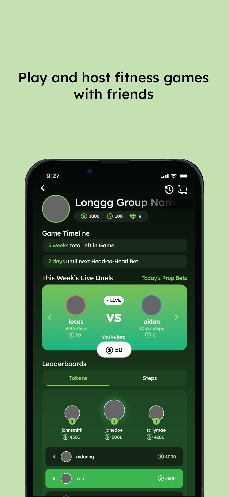
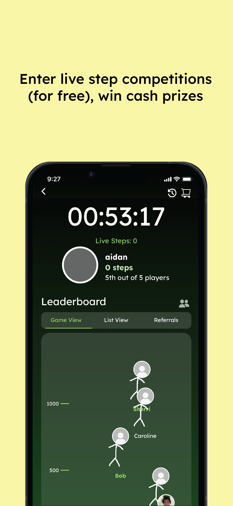
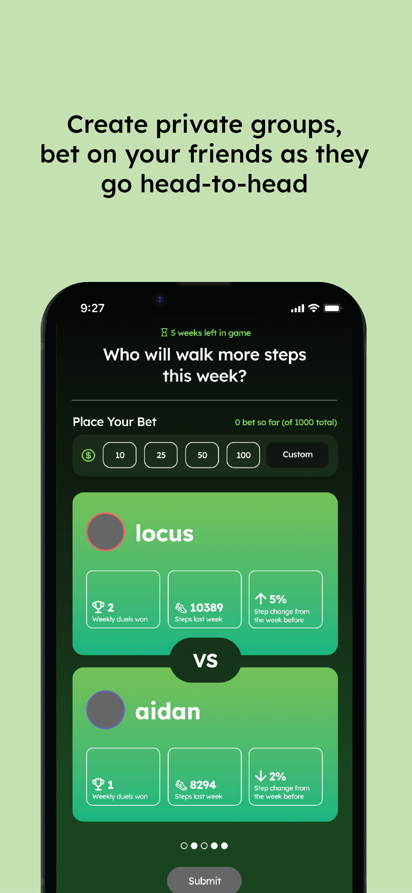
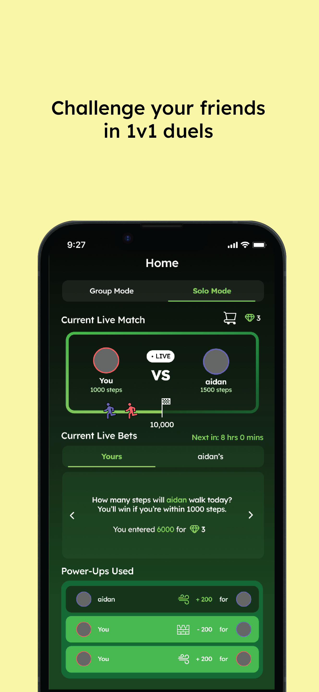
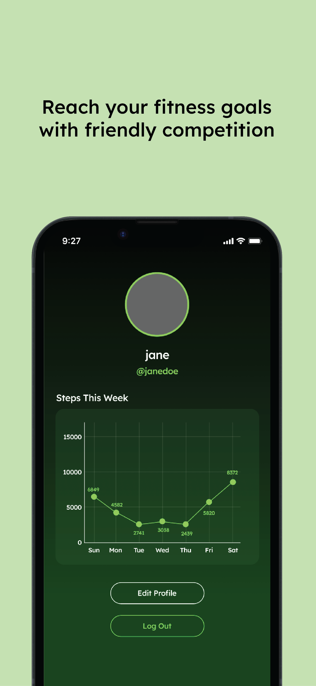

# Celeri

<p align="center">
  
</p>

<p align="center">
  <strong>Gamifying healthy habits for teens and young adults.</strong>
</p>

<p align="center">
  Celeri turns exercise into a social experience through competitions, challenges, bets, and live events.
</p>

<p align="center">
  <a href="https://linktr.ee/celeriapp">Linktree</a> •
  <a href="https://www.instagram.com/celeritheapp">Instagram</a> •
  <a href="mailto:appceleri@gmail.com">Email</a>
</p>

---

## What is Celeri?

Celeri is a mobile app built to help teens, college students, and young professionals build healthier habits through social motivation and gamification.

Instead of treating exercise like a chore, Celeri transforms movement into interactive games and competitions with friends.

Users can:

* Compete in team-based step challenges
* Place friendly in-game bets on head-to-head matchups
* Participate in one-on-one prop-bet style competitions
* Join weekly free-for-all competitions
* Attend monthly in-person community fitness events
* Track activity through Apple HealthKit and Google Health Connect

---

## Why We Built It

Young adults are exercising less than ever despite having more access to health information and fitness content.

Most health apps focus heavily on:

* long-term health consequences
* strict routines
* solo progress tracking

Celeri takes a different approach.

We believe people are more motivated by:

* competition
* accountability
* social interaction
* community
* fun

By combining gamification with real-world social dynamics, Celeri creates external motivation that encourages users to stay active consistently.

---

## Current Traction

* ~150 active beta testers
* Available on both iOS (TestFlight) and Android (Google Play testing)
* Real-time health syncing across Apple HealthKit and Google Health Connect
* Monthly in-person fitness events
* Continuous user feedback loops and iteration

Early beta testing showed meaningful increases in user activity and strong engagement around group competitions and social accountability.

---

## Core Features

### Team Competitions

Create groups with friends and participate in recurring team-based competitions centered around daily and weekly activity.

### Head-to-Head Betting

Users compete directly against each other in step-based matchups while friends place friendly in-game wagers using virtual currency.

### One-on-One Games

Smaller competitive formats featuring prop-style bets and personalized challenges.

### Weekly Free-for-All Events

Large-scale community competitions where users compete for leaderboard placement and rewards.

### Monthly In-Person Events

Community-driven fitness meetups and social events designed to encourage activity outside the app.

### Real-Time Step Sync

Celeri syncs user activity in real time using:

* Apple HealthKit
* Google Health Connect

### Anti-Cheat Systems

The app includes validation systems and syncing safeguards to help ensure fair competition integrity.

---

## Tech Stack

### Mobile

* React Native
* Expo
* TypeScript

### Backend & Infrastructure

* Firebase
* Firebase Cloud Functions / Cloud APIs
* Supabase (partial migration)
* Node.js backend services (partial migration)

### Health Integrations

* Apple HealthKit
* Google Health Connect

---

## Architecture Direction

Celeri originally launched on Firebase infrastructure and is currently evolving toward a hybrid SQL-based architecture using Supabase and Node.js services.

This migration supports:

* scalable real-time competitions
* improved analytics and querying
* more efficient live leaderboard systems
* future multiplayer and event infrastructure

---

## Screenshots

<p align="center">
  
  
  
  
  
</p>

---

## Local Development

### Prerequisites

* Node.js
* npm
* Expo Go app on your mobile device

### Installation

```bash
npm install expo-router
npm install
```

### Run the App

```bash
npx expo start
```

Then:

1. Open the Expo Go app on your phone
2. Scan the QR code shown in the terminal/browser
3. Launch the app directly on your device

---

## Health Data & Privacy

Celeri accesses step and activity data strictly to power competitions, leaderboards, and gameplay systems.

We do not sell personal health data.

Health integrations are permission-based and can be disabled by the user at any time.

For more information, view the full privacy policy:

* [Privacy Policy](https://docs.google.com/document/d/1P-GBkS_I6uScww0JXwNSnRxJ2-m5fEoC7_wwjnoR2Ss/edit?usp=sharing)

---

## Vision

We believe the future of fitness is:

* social
* competitive
* community-driven
* rewarding

Celeri aims to build a platform where healthy habits feel less like obligations and more like experiences people genuinely look forward to.

---

## Contributors

Aidan Ng

Lukas Chin

---

## License

This project is currently proprietary and not licensed for redistribution or commercial reuse.
